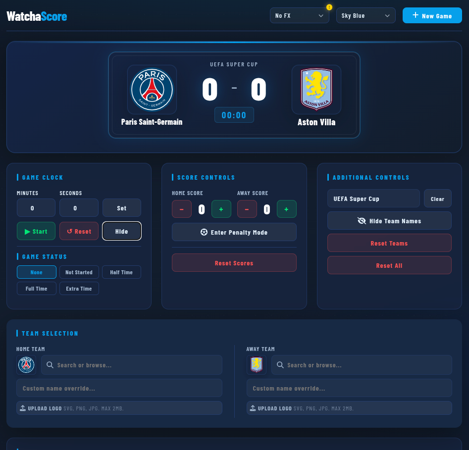

# WatchaScore

> **Live Demo:** [click here](https://watchascore.netlify.app/)



**WatchaScore** is a professional-grade, lightweight football scoreboard overlay designed for streamers and amateur broadcasters. Built with vanilla JavaScript and modern CSS, it provides a high-performance "TV-style" broadcast look that can be easily integrated into OBS or other streaming software as a browser source.

## 🚀 Features

- **Real-time Controls:** Manage scores, game clock, and status (HT, FT, etc.) instantaneously.
- **Dynamic Team Search:** Quickly find and select teams from a built-in database with league grouping and matched-text highlighting.
- **Team Visibility Toggle:** Quickly hide or show team names from the Team Selection panel.
- **Customization:** 
  - **Theme Engine:** Switch between 5 professional color palettes (Sky Blue, Light, Midnight, Crimson, Forest).
  - **Logo Upload:** Upload custom team badges directly from your local machine.
  - **Name Overrides:** Set custom display names for any team.
- **Persistence:** Automatically saves the game state to local storage so you don't lose data on page refresh.
- **Optimized for OBS:** Clean layout designed for high-visibility and easy cropping as a browser source.

## ⌨️ Keyboard Shortcuts

For power users, WatchaScore supports global hotkeys to keep your hands on the action:

| Shortcut | Action |
| :--- | :--- |
| `[Space]` | Start / Pause the game clock |
| `[C]` | Hide / Show clock |
| `[H]` | Increment Home Score / Home Penalty Scored (Penaly Mode)|
| `[Shift] + [H]` | Decrement Home Score / Home Penalty Missed (Penalty Mode) |
| `[A]` | Increment Away Score / Away Penalty Scored (Penaly Mode) |
| `[Shift] + [A]` | Decrement Away Score / Away Penalty Missed (Penalty Mode) |
| `[Shift] + [X]` | Trigger "Reset All" confirmation |

*Note: Shortcuts are disabled while typing in input fields.*

## 🛠️ Setup & Usage

**OBS Integration:** 
   - Copy the websites URL address.
   - In OBS, add a new **Browser Source** and paste the copied URL.
   - Paste the URL and set the width and height (**1920 x 1080** is recommended).
   - Crop by holding **Alt** and dragging the edges.
   - Use the **Interact** feature in OBS to manage the scoreboard during your stream.

## 📂 Project Structure

```text
watchascore/
├── index.html
├── style.css
├── script.js
├── teams.js
├── README.md
├── assets/
│   ├── badges/
│   └── fonts/
├── js/
│   ├── config/
│   │   └── constants.js
│   ├── core/
│   │   ├── custom-select.js
│   │   ├── event-bus.js
│   │   ├── modal-state.js
│   │   ├── notifications.js
│   │   ├── obs-source.js
│   │   ├── persistence.js
│   │   ├── shell-ui.js
│   │   └── state-batch.js
│   ├── features/
│   │   ├── game-clock.js
│   │   ├── media.js
│   │   ├── penalties.js
│   │   ├── scoreboard-ui.js
│   │   ├── team-names.js
│   │   └── team-search.js
│   └── utils/
│       └── helpers.js
```

## 🧭 Architecture Overview

- [script.js](script.js): Application composition root. Initializes state, wires core/feature managers, and binds app-level events.
- [teams.js](teams.js): Static data source for tournament and team definitions used by the search and team selectors.
- [js/config/constants.js](js/config/constants.js): Shared configuration, defaults, limits, and initial app state.
- [js/core/custom-select.js](js/core/custom-select.js): Reusable custom select/dropdown behavior used by selector UI.
- [js/core/event-bus.js](js/core/event-bus.js): Lightweight pub/sub used to propagate state changes to UI updates.
- [js/core/modal-state.js](js/core/modal-state.js): Centralized modal open/close state coordination and locking.
- [js/core/persistence.js](js/core/persistence.js): Local storage layer for saving and restoring game state and preferences.
- [js/core/notifications.js](js/core/notifications.js): Toast and in-app feedback utilities.
- [js/core/obs-source.js](js/core/obs-source.js): OBS context detection, top-scroll enforcement, preloader behavior, and OBS background-hole sync.
- [js/core/shell-ui.js](js/core/shell-ui.js): Main shell rendering and top-level UI wiring helpers.
- [js/core/state-batch.js](js/core/state-batch.js): Batched state-update helpers to reduce redundant renders.
- [js/features/game-clock.js](js/features/game-clock.js): Clock lifecycle, status transitions, and time rendering.
- [js/features/scoreboard-ui.js](js/features/scoreboard-ui.js): Scoreboard rendering layer (scores, teams, penalties, status, theme, and layout synchronization).
- [js/features/team-search.js](js/features/team-search.js): Team browsing/search UI, keyboard navigation, and selection behavior.
- [js/features/team-names.js](js/features/team-names.js): Name override handling and text fitting for broadcast-safe labels.
- [js/features/media.js](js/features/media.js): Team badge upload, image processing, and crop modal handling.
- [js/features/penalties.js](js/features/penalties.js): Penalty shootout mode logic, scoring states, and UI synchronization.
- [js/utils/helpers.js](js/utils/helpers.js): Reusable helpers (debounce, text formatting, edit-distance, keyboard helpers).

Runtime flow:
1. [script.js](script.js) loads persisted state via [js/core/persistence.js](js/core/persistence.js).
2. Core and feature managers are instantiated (including [js/core/obs-source.js](js/core/obs-source.js) and [js/features/scoreboard-ui.js](js/features/scoreboard-ui.js)).
3. State changes are batched and broadcast through [js/core/event-bus.js](js/core/event-bus.js), then rendered by the UI layer.
4. Updated state is persisted automatically, so refreshes restore the previous match context.

## 🤝 Contributing

WatchaScore is an open-source project. Feel free to fork the repository, report bugs, or submit pull requests to help improve the tool for the community.

## 📄 License

This project is free and open-source.

---

*Developed for the love of the game.* ⚽

[!Support](https://www.paypal.me/vds91)
[!Coffee](https://www.buymeacoffee.com/vds1)
